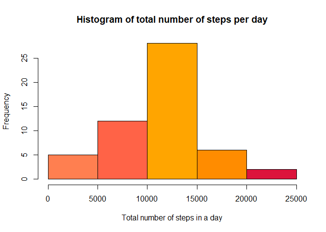
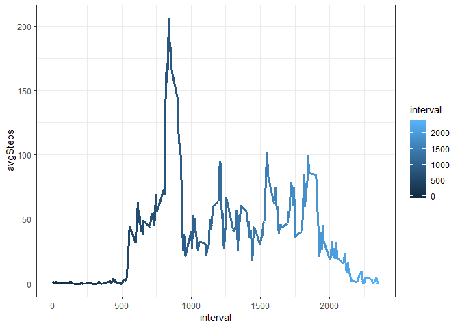
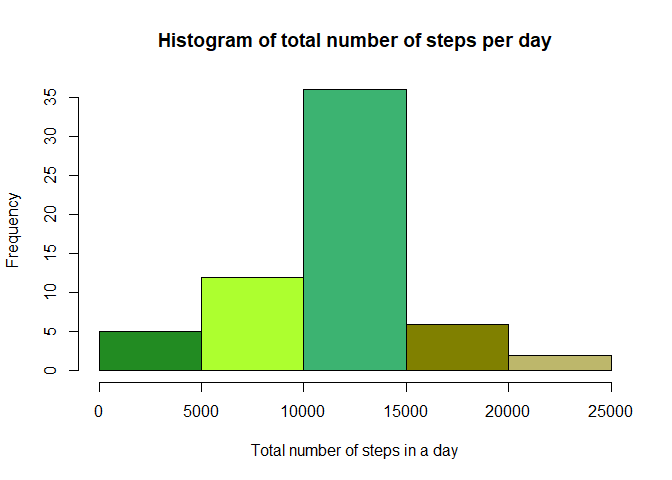
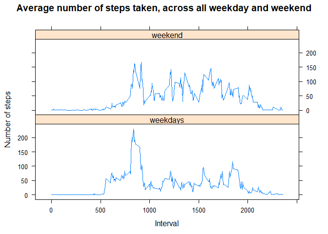

## Loading and preprocessing the data

```r
dat <- read.csv("activity.csv")
```
## View the data

```r
#Let's take a look for the data first
head(dat)
```

```
##   steps       date interval
## 1    NA 2012-10-01        0
## 2    NA 2012-10-01        5
## 3    NA 2012-10-01       10
## 4    NA 2012-10-01       15
## 5    NA 2012-10-01       20
## 6    NA 2012-10-01       25
```
## A. What is mean total number of steps taken per day?

1. Calculate the total number of steps taken per day

```r
library(tidytext);library(tidyverse)
```

```
## -- Attaching packages ------------------------------------------------------------- tidyverse 1.2.1 --
```

```
## v ggplot2 3.0.0     v purrr   0.2.5
## v tibble  1.4.2     v dplyr   0.7.6
## v tidyr   0.8.1     v stringr 1.3.1
## v readr   1.1.1     v forcats 0.3.0
```

```
## -- Conflicts ---------------------------------------------------------------- tidyverse_conflicts() --
## x dplyr::filter() masks stats::filter()
## x dplyr::lag()    masks stats::lag()
```

```r
steps_per_day <- dat %>%
  filter(!is.na(steps))%>%
  group_by(date) %>%
  summarise (stepsPerDay = sum(steps))
```
2. Make a histogram of the total number of steps taken each day

```r
hist(steps_per_day$stepsPerDay, main="Histogram of total number of steps per day", 
     xlab="Total number of steps in a day", col=c("#FF7F50","#FF6347","#FFA500","#FF8C00","#DC143C"))
```

<!-- -->

3. Calculate and report the mean and median of the total number of steps taken per day

The mean and median of the total number of steps taken per day are 10766 and 10765 respectively.

```r
summary(steps_per_day)
```

```
##          date     stepsPerDay   
##  2012-10-02: 1   Min.   :   41  
##  2012-10-03: 1   1st Qu.: 8841  
##  2012-10-04: 1   Median :10765  
##  2012-10-05: 1   Mean   :10766  
##  2012-10-06: 1   3rd Qu.:13294  
##  2012-10-07: 1   Max.   :21194  
##  (Other)   :47
```
## B. What is the average daily activity pattern?

1. Filter all the NA values across the dataset

```r
avgDailyAct <- dat %>%
  filter(!is.na(steps))%>%
  group_by(interval)  %>% summarise(avgSteps = mean(steps))

head(avgDailyAct)
```

```
## # A tibble: 6 x 2
##   interval avgSteps
##      <int>    <dbl>
## 1        0   1.72  
## 2        5   0.340 
## 3       10   0.132 
## 4       15   0.151 
## 5       20   0.0755
## 6       25   2.09
```
2. Make the time series plot of the 5-minute interval (x-axis) and the average number of steps taken, averaged across all days (y-axis)

```r
library(ggplot2);library(viridis)
```

```
## Loading required package: viridisLite
```

```r
vPalette <-viridis(5) 
ggplot(avgDailyAct, aes(interval, avgSteps))+geom_line(aes(color = interval), size=1.2)+
   scale_fill_manual(values=vPalette)+theme_bw()
```

<!-- -->

## C. Imputing missing values by the following steps:

1. Find which interval has the maximum number of steps

```r
#The interval 835 has the maximum number of steps which is 206
whichmax <- which.max(avgDailyAct$avgSteps)
print(avgDailyAct[whichmax,])
```

```
## # A tibble: 1 x 2
##   interval avgSteps
##      <int>    <dbl>
## 1      835     206.
```
2. Calculate and report the total number of missing values in the dataset (i.e. the total number of rows with NAs).  

```r
#Find and calculate  the NA value across the dataset
print(sum(is.na(dat)))
```

```
## [1] 2304
```
3. Devise a strategy for filling in all of the missing values in the dataset. The strategy does not need to be sophisticated. For example, you could use the mean/median for that day, or the mean for that 5-minute interval, etc.

```r
#Fill the missing value with the mean value for that 5-minute interval
df_without_na <- aggregate(steps ~ interval, FUN=mean, data=dat)
head(df_without_na)
```

```
##   interval     steps
## 1        0 1.7169811
## 2        5 0.3396226
## 3       10 0.1320755
## 4       15 0.1509434
## 5       20 0.0754717
## 6       25 2.0943396
```
4. Create a new dataset that is equal to the original dataset but with the missing data filled in.

```r
# Merge the original dataset and the modified dataset(without NA)
df.merge <- merge(x = dat, y=df_without_na, by="interval")
## here the original steps column name is the same as steps x, while the steps.y column is the mean value for each interval
df.merge$steps.x <- ifelse(is.na(df.merge$steps.x), df.merge$steps.y, df.merge$steps.x)
colnames(df.merge) <- c("interval", "steps", "date", "meanPerInterval")
df <- df.merge[c("steps", "date", "interval")]
```

5. Make a histogram of the total number of steps taken each day and Calculate and report the mean and median total number of steps taken per day. Do these values differ from the estimates from the first part of the assignment? What is the impact of imputing missing data on the estimates of the total daily number of steps?

```r
df.final <- df %>%
  group_by(date)  %>% summarise(stepsPerDay = sum(steps)) 

#construct the histogram 
hist(df.final$stepsPerDay, main="Histogram of total number of steps per day", 
     xlab="Total number of steps in a day", col=c("#228B22","#ADFF2F","#3CB371","#808000","#BDB76B"))
```

<!-- -->

```r
#print the mean and median value
print(mean(df.final$stepsPerDay))
```

```
## [1] 10766.19
```

```r
print(factor(median(df.final$stepsPerDay)))
```

```
## [1] 10766.1886792453
## Levels: 10766.1886792453
```
Conclusion: By replacing missing values, the median value shifted closer or approximately equal to mean value.

## D. Are there differences in activity patterns between weekdays and weekends?

1. Create a new factor variable in the dataset with two levels - "weekday"
and "weekend" indicating whether a given date is a weekday or weekend
day.

```r
weekdayAndWeekend <- df %>%
  select(steps, date, interval)%>%
  mutate(category = as.factor(ifelse(weekdays(as.Date(date)) %in% c("Saturday", "Sunday"), "weekend", "weekdays")))  
```
2. Make a panel plot containing a time series plot (i.e. type = "l") of the 5-minute interval (x-axis) and the average number of steps taken, averaged across all weekday days or weekend days (y-axis).

```r
library(lattice)
df.weekdayWeekend <- weekdayAndWeekend %>%
  group_by(category, interval) %>% summarise(avg = mean(steps))


xyplot(avg ~ interval | category, df.weekdayWeekend
     , type = "l"
     , xlab = "Interval"
     , ylab = "Number of steps"
     , main = "Average number of steps taken, across all weekday and weekend"
     , layout = c(1, 2))
```

<!-- -->
